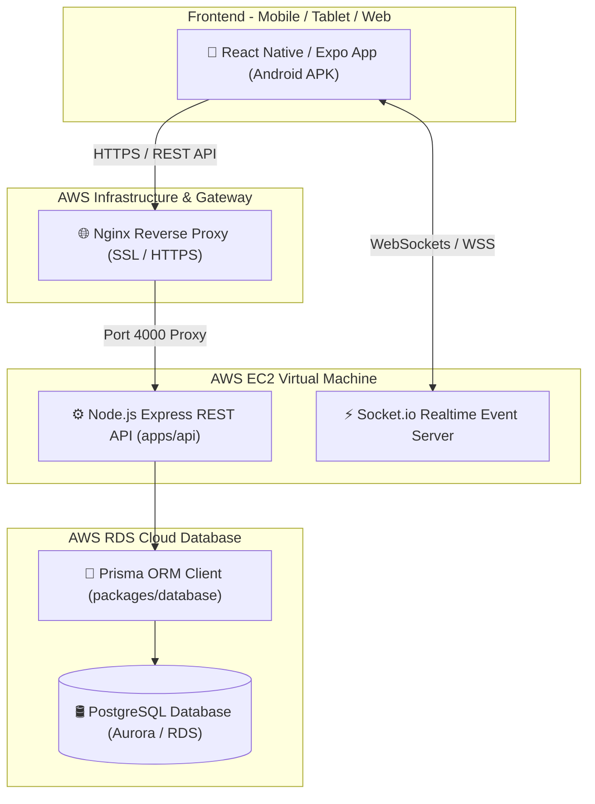
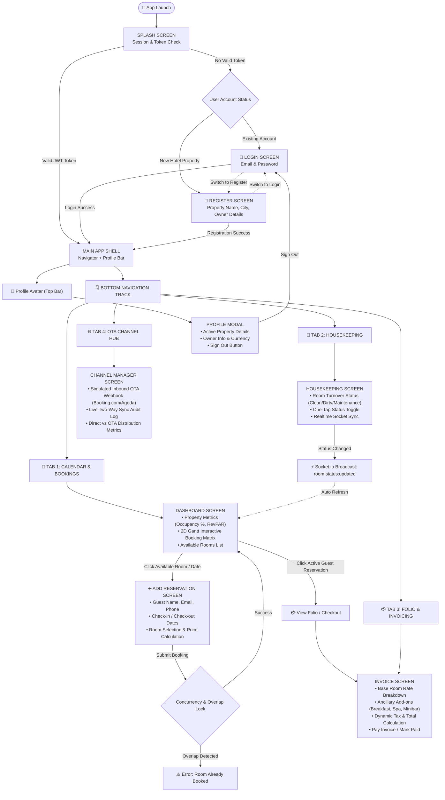
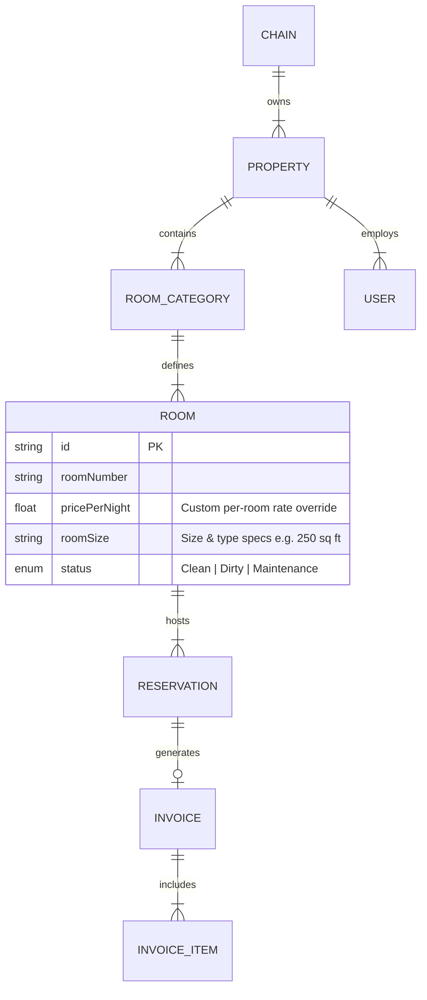

# Simply Booking - Hotel Property Management System (PMS)
## Architecture & Screen Flow Documentation

This document provides a comprehensive, easy-to-understand guide to the architecture, screen navigation flow, data models, and system components of **Simply Booking**.

---

## 🏗️ 1. High-Level System Architecture

Simply Booking is built as a production-grade TypeScript **Monorepo** using npm workspaces.

---

## 📱 2. Screen Flow & User Journey Diagram

The following diagram illustrates the complete user flow from app launch, authentication, main dashboard navigation, reservation creation, housekeeping management, billing, and OTA channels.

---

## 🧭 3. Detailed Screen Descriptions

### 1. **Authentication Flow**
* **Splash Screen**: Checks `AsyncStorage` for a stored JWT session token.
* **Login Screen**: Authenticates existing property owners or staff members (`demo@simplybooking.com` / `password123`).
* **Register Screen**: Onboards new hotel properties by capturing property name, address, city, country, currency, owner name, email, and password in a single SaaS registration step.

### 2. **Calendar & Booking Tab (`DashboardScreen` & `AddReservationScreen`)**
* **2D Gantt Chart**: Displays a live timeline grid of all property rooms versus calendar dates. Renders room number, dynamic room rate (e.g. `Deluxe • ₹3,100/night`), and room size specification badge (e.g. `📐 280 sq ft (Corner)`).
* **Add In-House Room Modal**: Allows hotel managers to add rooms on the fly with custom room numbers, dynamic room category creation (`+ Add New Category` to define custom categories like *Luxury Villa*, *Single Bed Room*, *Penthouse*), individual nightly rate override (`pricePerNight`), room dimensions/specs (`roomSize`), and initial cleanliness status (`Clean`, `Dirty`, `Maintenance`).
* **Interactive Slot Click**: Tapping any empty cell pre-fills check-in date and room details into the booking form.
* **Add Reservation Screen**: Captures guest details, calculates total stay costs using dynamic per-room rates (`pricePerNight ?? category.basePrice`), displays room sizes in the room picker, and handles concurrency locking to prevent double bookings.

### 3. **Housekeeping & Turnover Tab (`HousekeepingScreen`)**
* **Turnover Statuses**: `CLEAN`, `DIRTY`, `MAINTENANCE`.
* **Instant Toggle**: Staff can change room cleanliness status with a single tap.
* **Realtime Sync**: Emits Socket.io events to update room colors on the 2D Gantt dashboard instantly across all devices.

### 4. **Folio & Invoicing Tab (`InvoiceScreen`)**
* **Itemized Billing**: Combines dynamic room rates (`pricePerNight ?? category.basePrice`) with ancillary charges (room service, laundry, spa).
* **Payment Processing**: Calculates taxes automatically (18% GST) and records payments (`PAID` / `UNPAID` status).

### 5. **OTA Channel Hub Tab (`ChannelManagerScreen`)**
* **Webhook Simulator**: Simulates inbound reservations originating from external OTAs (e.g. Booking.com, Expedia, Agoda).
* **Two-Way Synchronization**: Automatically reserves rooms in PostgreSQL and updates distribution metrics (Direct vs OTA ratio).

---

## 🗄️ 4. SaaS Data Hierarchy

---

## 🛠️ 5. Technology Stack Summary

* **Frontend**: React Native, Expo, React Native Safe Area Context, Socket.io Client.
* **Backend**: Node.js, Express, TypeScript, Socket.io, JWT Authentication, Bcrypt password hashing.
* **Database**: PostgreSQL on AWS RDS (Aurora Serverless), Prisma ORM v6.
* **Infrastructure**: AWS EC2 (Ubuntu Linux) + Docker / PM2 + Nginx Reverse Proxy with SSL/HTTPS.
