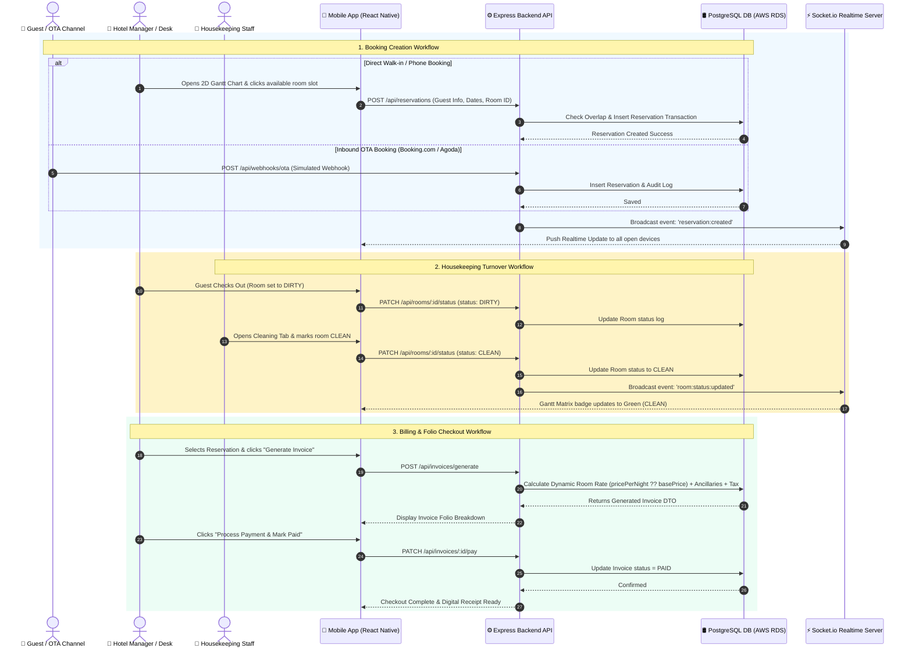
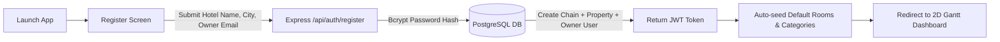
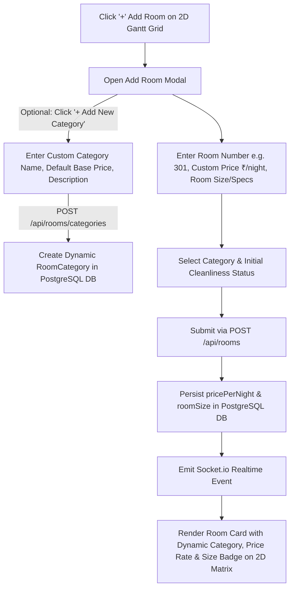
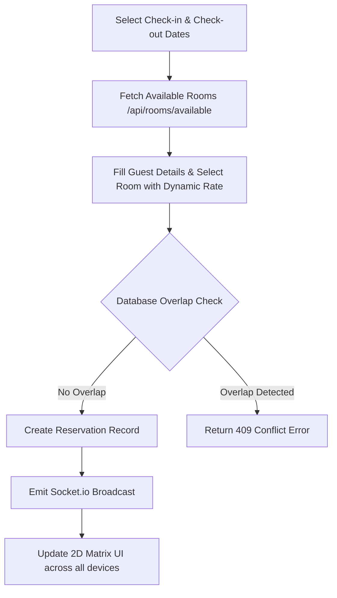
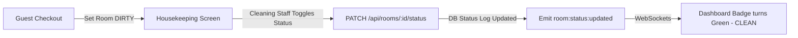
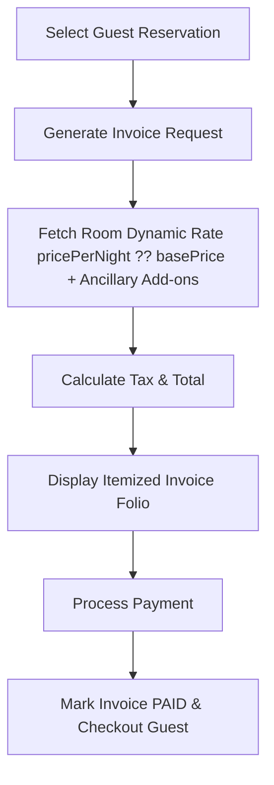

# Simply Booking - Hotel PMS Operational Workflow Documentation

This document contains the dedicated, step-by-step operational workflows and interaction sequence diagrams for **Simply Booking**.

---

## 🔄 1. End-to-End Hotel Operational Lifecycle Workflow

The sequence diagram below details the entire lifecycle of a reservation—from guest booking and channel synchronization to housekeeping room turnover and final bill checkout.

---

## 📋 2. Sub-System Workflow Breakdown

### 🏨 A. Property Onboarding Workflow

### 🚪 B. Room Creation & Dynamic Category / Pricing Workflow

### 📅 C. Booking & Concurrency Lock Workflow

### 🧹 D. Housekeeping Turnover Workflow

### 💳 E. Billing & Folio Checkout Workflow

---

## ⚡ 3. Realtime Socket.io Event Registry

| Event Name | Trigger Source | Payload | Target Action |
| :--- | :--- | :--- | :--- |
| `reservation:created` | New Booking / OTA Webhook | `ReservationDTO` | Adds bar to 2D Gantt Matrix |
| `room:status:updated` | Housekeeping Toggle / Room Creation | `{ roomId, roomNumber, newStatus }` | Updates room cleanliness badge & list on 2D Matrix |
| `channel:synced` | Inbound Webhook Processed | `ChannelSyncLogDTO` | Updates OTA Hub audit logs |
